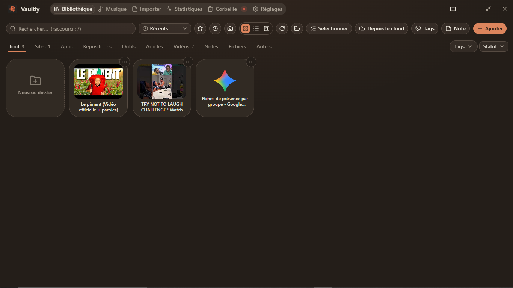
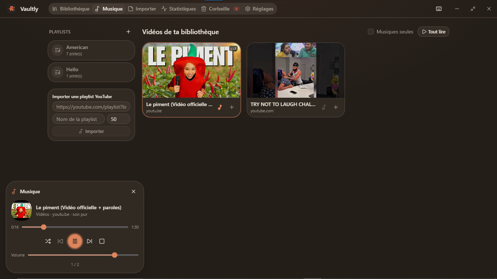

# Vaultly

Vaultly est un hub personnel pour rassembler tes sites, apps, fichiers, notes et
vidéos au même endroit.

Le but est simple : tu ouvres une ressource, tu la ranges, tu la retrouves, et
tu peux la faire exploiter par une IA quand l’app est ouverte.






## C’est quoi, concrètement ?

Vaultly, c’est une fenêtre avec des tuiles.

Tu peux y mettre :

- des sites web
- des liens GitHub
- des apps locales
- des fichiers
- des notes
- des vidéos YouTube, TikTok, Vimeo, Dailymotion ou Twitch

Et tu les classes comme tu veux : dossiers, tags, favoris, statuts, recherche,
palette de commandes.

## Ce que tu peux faire avec

### Ranger tes ressources

- ajouter un lien et récupérer automatiquement titre/favicon
- créer des dossiers et sous-dossiers
- glisser-déposer pour réorganiser
- recherche rapide avec `/`
- palette de commandes avec `Ctrl+K`

### Garder des notes

Vaultly a des notes post-it directement dans la bibliothèque : titres, listes,
liens, couleurs.

### Écouter de la musique

Tu peux mettre des liens vidéo dans une playlist et les écouter dans l’app,
même fenêtre réduite.

Le lecteur peut se réduire en mini-barre, puis en petit bouton flottant avec la
pochette du morceau en cours.

### Connecter une IA

Quand Vaultly est ouvert, une IA compatible MCP peut :

- chercher dans ta bibliothèque
- lire une ressource
- en ajouter une nouvelle
- créer des dossiers
- vérifier des liens morts
- lancer certaines apps

Les tokens et snippets de configuration sont dans **Réglages**.

### Sauvegarder et retrouver

- corbeille avec restauration pendant 30 jours
- backup automatique local
- export/import JSON
- sauvegarde cloud WebDAV : Koofr, Nextcloud, Synology…
- extension navigateur pour ajouter une page en un clic

## Ce que tu dois savoir

### Tes données restent chez toi

Vaultly est local. La base est dans un dossier sur ta machine. Il n’y a pas de
compte Vaultly obligatoire et pas de cloud par défaut.

Quelques fonctions peuvent utiliser Internet quand tu les déclenches :

- récupérer le titre d’un lien
- afficher une favicon
- vérifier un lien mort
- demander une archive web
- sauvegarder sur ton WebDAV personnel

### Les tokens sont sensibles

Le token MCP donne accès à ta bibliothèque quand l’app tourne.
Le token de l’extension ne peut que ajouter des liens.

Si tu partages une machine ou si tu penses qu’un token a fuité, régénère-le
dans **Réglages**.

### Raccourcis utiles

| Action | Raccourci |
|---|---|
| Recherche bibliothèque | `/` |
| Palette de commandes | `Ctrl+K` |
| Palette globale Windows | `Ctrl+Alt+Espace`, configurable |
| Déplacer une ressource au clavier | `Ctrl+Maj+←` ou `Ctrl+Maj+→` |
| Fermer la fenêtre | l’app se masque dans la barre des tâches |

### Linux : le trousseau système

Sous Linux, Vaultly essaie de protéger tes tokens avec le trousseau système.
Si ce n’est pas disponible, l’app peut te prévenir que certains secrets sont
stockés en clair.

### macOS

A venir

## Télécharger

La dernière version est ici :

https://github.com/kevsi/Vaultly/releases/latest

Versions actuellement publiées :

- Windows : `.exe` et `.msi`
- Linux : `.deb` et `.AppImage`

## Pour les développeurs

### Prérequis

- Node 22
- pnpm
- Rust
- dépendances système Tauri de ton OS

### Lancer le projet

```bash
pnpm install
pnpm tauri dev
```

### Construire l’app

```bash
pnpm tauri build
```

### Commandes utiles

```bash
pnpm lint
pnpm test
pnpm build
```

## Architecture rapide

```
src/              interface React
src-tauri/        backend Rust, SQLite, MCP, WebDAV
extension/        extension navigateur
vaultly-landing/  page de téléchargement
```
